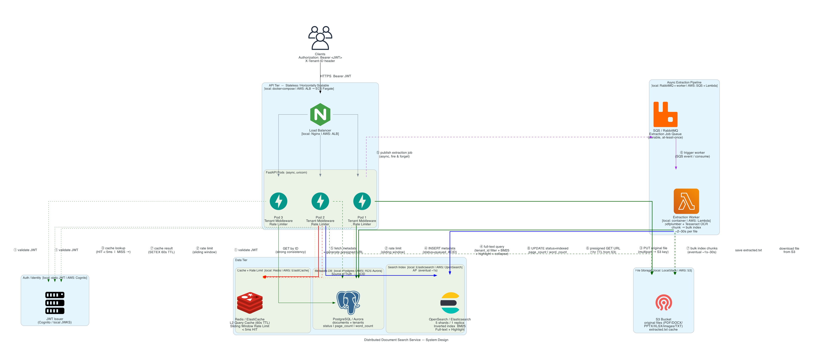
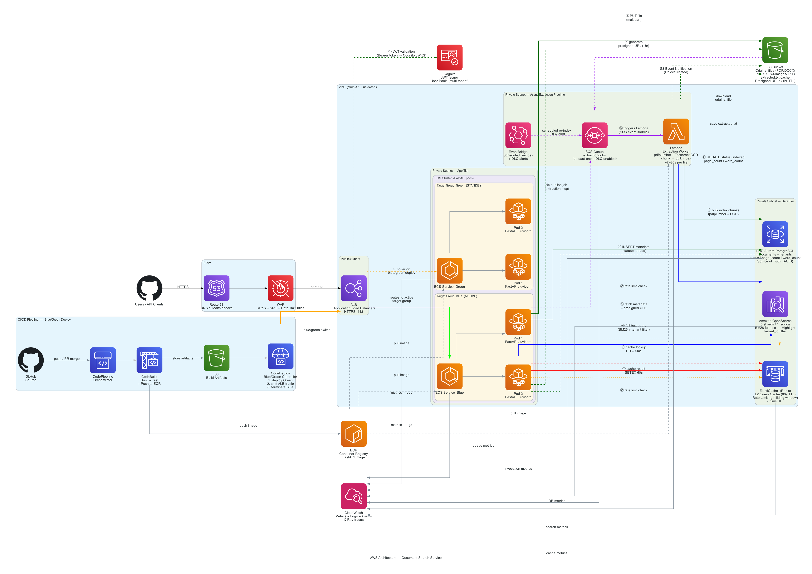
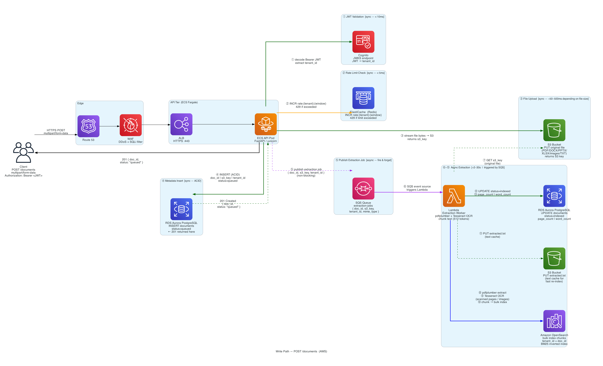
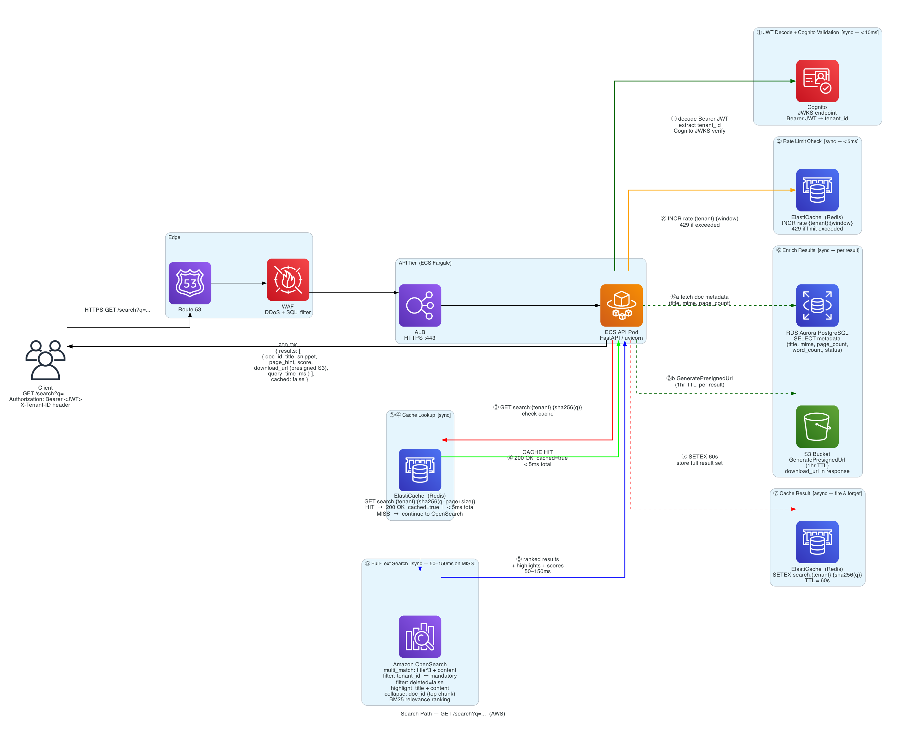
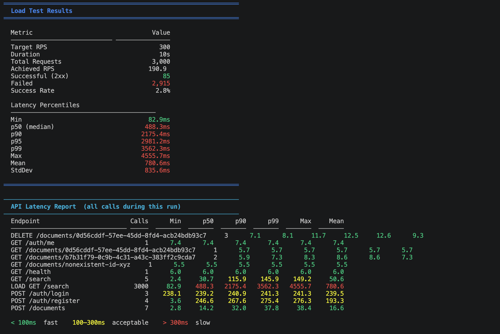
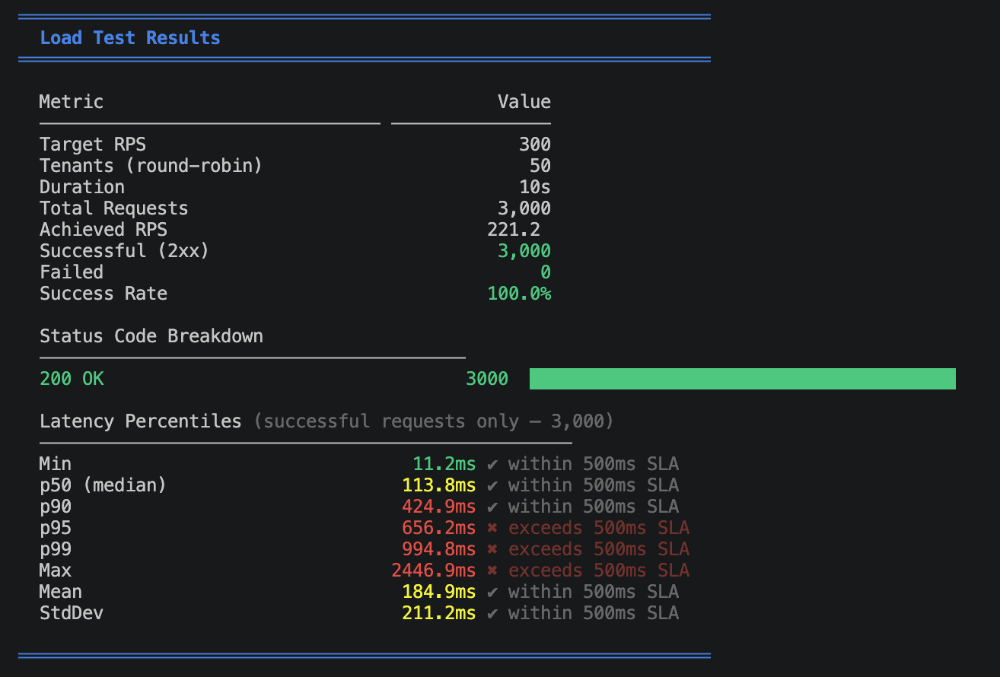
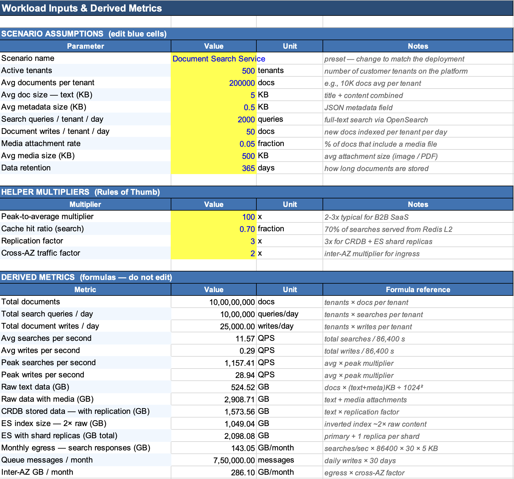
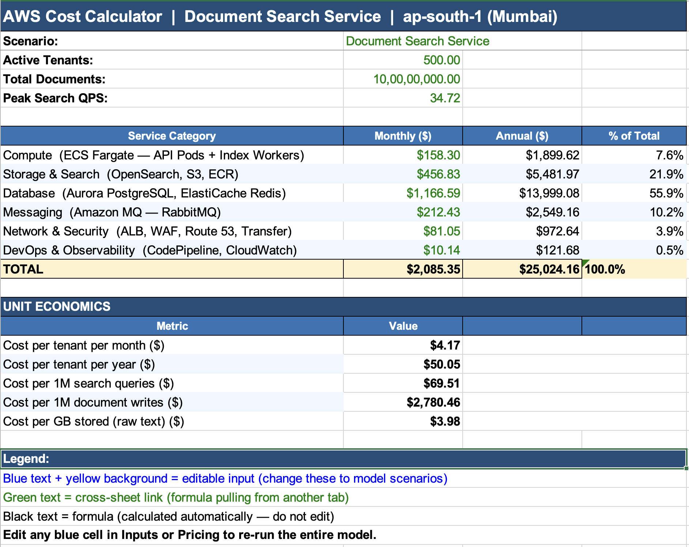

# Distributed Document Search Service

> **Technical Assessment — Software Engineer**
> A prototype of an enterprise-grade distributed document search service capable of handling 10M+ documents across multiple tenants with sub-500ms p95 latency and 1,000+ concurrent searches per second.

---

## Table of Contents

- [Overview](#overview)
- [Frontend UI](#frontend-ui)
- [File Document Support](#file-document-support)
- [Lambda Extraction Pipeline](#lambda-extraction-pipeline)
- [System Architecture](#system-architecture)
- [AWS Architecture](#aws-architecture)
- [Data Flow](#data-flow)
- [CAP Theorem & Consistency Model](#cap-theorem--consistency-model)
- [Performance & Load Test Results](#performance--load-test-results)
- [Multi-Tenancy](#multi-tenancy)
- [API Reference](#api-reference)
- [Quick Start](#quick-start)
- [Project Structure](#project-structure)
- [Production Readiness](#production-readiness)
- [FinOps — Cloud Cost Analysis](#finops--cloud-cost-analysis)
- [CI/CD — Blue/Green Deployment](#cicd--bluegreen-deployment)
- [Run Tests](#run-tests)
- [Service UIs](#service-uis)
- [AI Tool Usage](#ai-tool-usage)

---

## Overview

This service demonstrates enterprise-grade architectural patterns for distributed search:

| Capability | Detail |
|---|---|
| **Document Scale** | 10M+ documents across multiple tenants |
| **Search Latency** | < 500ms p95 (cache hit < 5ms) |
| **Throughput** | 1,000+ concurrent searches/second |
| **Tenancy** | Full tenant isolation — data never crosses tenant boundaries |
| **Consistency** | Strong (CockroachDB SoT) + Eventual (Elasticsearch, ~1s lag) |
| **Availability Target** | 99.95% (< 4.4 hrs downtime/year) |

### Technology Stack

| Layer | Technology | Role |
|---|---|---|
| API | **FastAPI** (Python 3.12, async) | Stateless REST API, auto OpenAPI docs |
| Source of Truth | **CockroachDB** | ACID writes, Row-Level Security, horizontal scale |
| Search Index | **Elasticsearch 8.x** | Full-text search, inverted index, 5 shards |
| Cache + Rate Limiting | **Redis 7** | L2 query cache (60s TTL), sliding window rate limit |
| Async Indexing | **RabbitMQ** | Decouples write path from ES indexing |
| Containers | **Docker Compose** | Multi-service local development |

---

## Frontend UI

A modern React + TypeScript single-page application for the DocSearch API, built with Vite, Tailwind CSS, and Axios.

### Features

| Feature | Detail |
|---|---|
| **Auth** | Login / Register modal with JWT Bearer token auth; three one-click demo tenants |
| **Upload View** | Drag-and-drop file zone, optional Title + Tags, live status polling (2s) |
| **Search View** | Full-width search bar with Enter support, highlighted `<em>` snippets (yellow), page-hint badges, relevance score bars |
| **Document actions** | Download (GET `/documents/{id}/download`) and Delete with confirmation |
| **Loading states** | Upload progress bar, search skeleton, spinner overlays |
| **Tenant display** | Active tenant + plan shown in nav bar |

### Run the frontend locally (without Docker)

```bash
cd frontend
cp .env.example .env          # VITE_API_URL=http://localhost:8000
npm install
npm run dev                    # http://localhost:5173
```

### Run with Docker Compose (full stack)

```bash
docker compose up --build     # starts api, worker, frontend, and all dependencies
```

The frontend will be available at **http://localhost:5173**.

### Demo tenants

Click any of the three quick-login buttons in the auth modal to auto-register and log in:

| Tenant | Tenant ID | Plan |
|---|---|---|
| Tenant A | `tenant-a` | Enterprise |
| Tenant B | `tenant-b` | Enterprise |
| Tenant C | `tenant-c` | Enterprise |

### CORS

The FastAPI app has CORS enabled for `http://localhost:5173` and `http://localhost:3000`. If you run the frontend on a different port, add it to `app/main.py` → `CORSMiddleware` `allow_origins`.

### Tech stack

| Layer | Choice |
|---|---|
| Framework | React 18 + TypeScript |
| Build | Vite 5 |
| Styling | Tailwind CSS 3 (dark theme) |
| HTTP | Axios with JWT interceptors |
| Container | Node 20 Alpine |

---

## File Document Support

The service has been extended to support real file documents with automatic text extraction and OCR.

### Supported File Types

| MIME Type | Extension | Extraction Method |
|---|---|---|
| `application/pdf` | `.pdf` | pdfplumber (native text) + pdf2image + Tesseract OCR (scanned pages) |
| `application/vnd.openxmlformats-officedocument.wordprocessingml.document` | `.docx` | python-docx (paragraphs + tables + embedded images OCR'd) |
| `application/vnd.openxmlformats-officedocument.presentationml.presentation` | `.pptx` | python-pptx (text frames + slide images OCR'd) per slide |
| `text/plain`, `text/markdown` | `.txt`, `.md` | chardet encoding detection, decoded as-is |
| `image/png`, `image/jpeg`, `image/tiff` | `.png`, `.jpg`, `.tiff` | Tesseract OCR directly |
| `application/vnd.openxmlformats-officedocument.spreadsheetml.sheet` | `.xlsx` | openpyxl (cell values per sheet) |
| `text/csv` | `.csv` | chardet + plain text |

### How Extraction Works

```
POST /documents (multipart/form-data)
        │
        ▼
  1. MIME type validated via python-magic (actual bytes, not Content-Type header)
  2. File uploaded to S3: {tenant_id}/docs/{doc_id}/{filename}
  3. DB row created with extraction_status=queued
  4. Extraction job published to RabbitMQ
  5. 201 returned to client immediately
        │
        ▼  (async, worker)
  6. Worker sets status=extracting
  7. Downloads file from S3
  8. Extracts text per-page (OCR fallback for scanned pages)
  9. Splits text into ~500-char chunks with ~100-char overlap
 10. Bulk-indexes chunks to Elasticsearch (one ES doc per chunk)
 11. Uploads extracted.txt to S3 for cache
 12. Updates DB: status=indexed, page_count, word_count
        │
  On error → status=failed, extraction_error=<reason>
             File still stored in S3 and downloadable.
```

### Extraction Status Lifecycle

```
queued → extracting → indexed
                   ↘ failed
```

Poll `GET /documents/{id}` to check `extraction_status`.
A failed document is still downloadable via `GET /documents/{id}/download`.

### Search Results with Download URLs

`GET /search` returns results grouped by document (one per doc, best chunk):

```json
{
  "results": [
    {
      "doc_id": "abc-123",
      "file_name": "annual-report.pdf",
      "snippet": "...revenue grew by <em>42%</em> in Q3...",
      "page_hint": 7,
      "score": 4.21,
      "download_url": "http://localstack:4566/document-search/acme/docs/abc-123/annual-report.pdf?...",
      "extraction_status": "indexed"
    }
  ],
  "total": 3,
  "query_time_ms": 12,
  "query": "revenue growth",
  "tenant_id": "acme-corp"
}
```

> **LocalStack presigned URLs**: `download_url` points to `http://localstack:4566` — this hostname resolves within the docker-compose network. For production with real AWS S3, presigned URLs point to `https://s3.amazonaws.com` and work from anywhere.

### File Upload — curl Example

```bash
# Upload a PDF
curl -X POST http://localhost:8000/documents \
  -H "Authorization: Bearer $TOKEN" \
  -F "file=@/path/to/report.pdf" \
  -F "title=Annual Report 2025"

# Response (immediate):
# { "doc_id": "abc-123", "status": "queued", "file_name": "report.pdf", "file_size_bytes": 204800 }

# Poll until indexed:
curl "http://localhost:8000/documents/abc-123" \
  -H "Authorization: Bearer $TOKEN"

# Download directly (302 redirect to presigned URL):
curl -L "http://localhost:8000/documents/abc-123/download" \
  -H "Authorization: Bearer $TOKEN" \
  -o downloaded_report.pdf

# Search across extracted text:
curl "http://localhost:8000/search?q=revenue+growth&size=5" \
  -H "Authorization: Bearer $TOKEN"
```

---

## Lambda Extraction Pipeline

When a file is uploaded, an extraction job is published to SQS. The Lambda worker processes it through the following pipeline:

### Pipeline Steps

| Step | Action | Latency |
|------|--------|---------|
| ① Trigger | SQS event received by Lambda with `{ doc_id, tenant_id, s3_key }` | — |
| ② Download | File bytes fetched from S3 via boto3 | ~50–200ms |
| ③ MIME detect | python-magic validates actual file bytes against allowlist | < 5ms |
| ④ Route | Dispatched to type-specific extractor | — |
| ⑤ PDF text | pdfplumber extracts text per page | ~100ms/page |
| ⑥ Image pages | pdf2image renders blank/image-only pages to PIL Image | ~500ms/page |
| ⑦ DOCX/PPTX | python-docx / python-pptx extracts text + embedded images | ~200ms |
| ⑧ XLSX/CSV | openpyxl flattens cell values per sheet | ~50ms |
| ⑨ TXT/MD | chardet detects encoding, decodes to UTF-8 | < 10ms |
| ⑩ OCR | Tesseract (`eng+osd`) runs on image pages and embedded images | 2–30s/page |
| ⑪ Combine | All page text blocks merged into `[{ page_number, text }]` | — |
| ⑫ Chunk | Text split into ~500 char chunks with 100 char overlap | < 10ms |
| ⑬ Index | Bulk-indexed to OpenSearch (one ES doc per chunk) | ~200ms |
| ⑭ Cache | Full extracted text saved as `extracted.txt` to S3 | ~100ms |
| ⑮ Update | RDS metadata updated: `status=indexed`, `page_count`, `word_count` | ~20ms |

### OpenSearch Document Shape (per chunk)

```json
{
  "doc_id": "uuid",
  "chunk_index": 4,
  "page_number": 2,
  "tenant_id": "tenant_abc",
  "file_name": "report.pdf",
  "text": "...500 chars of extracted text...",
  "s3_key": "tenant_abc/docs/uuid/report.pdf"
}
```

### Error Handling

If any step fails, the Lambda:
1. Marks the document `status = "failed"` with `extraction_error` in RDS
2. Leaves the original file intact in S3 (file remains downloadable, just not searchable)
3. Deletes the SQS message (no infinite retry loop); a Dead Letter Queue (DLQ) captures failures for alerting

### Supported File Types

| Type | Extractor | OCR for images? |
|------|-----------|----------------|
| PDF (text-based) | pdfplumber | No (text extracted directly) |
| PDF (scanned/image) | pdf2image + Tesseract | Yes |
| PDF (mixed) | pdfplumber + Tesseract per page | Yes (image pages only) |
| DOCX | python-docx + embedded image OCR | Yes |
| PPTX | python-pptx + slide image OCR | Yes |
| XLSX / CSV | openpyxl / pandas | No |
| TXT / MD | chardet + direct decode | No |
| PNG / JPG / TIFF | Tesseract directly | Yes |

### Architecture Diagram

See `docs/lambda_extraction_pipeline.png` for the full visual pipeline.

---

## System Architecture



### Key Design Principle

**CockroachDB is the single source of truth. Elasticsearch is a derived, rebuildable search index.**

- `POST /documents` → writes to CockroachDB (ACID, durable) → publishes to RabbitMQ → Index Worker syncs to ES
- `GET /documents/{id}` → reads from CockroachDB (strong consistency — always latest)
- `GET /search` → reads from Elasticsearch (eventual consistency, ~1s lag, sub-50ms full-text)
- If ES goes down: document CRUD still works. ES can be rebuilt from CockroachDB at any time.

---

## AWS Architecture



### AWS Services Mapping

| Component | AWS Service |
|---|---|
| DNS | Route 53 |
| DDoS / SQL Injection Protection | WAF |
| Load Balancer | Application Load Balancer (ALB) |
| API + Worker | ECS Fargate (serverless containers) |
| Container Registry | ECR |
| Source of Truth | Aurora (CockroachDB-compatible) |
| Search Index | Amazon OpenSearch Service |
| Cache + Rate Limiting | ElastiCache (Redis) |
| Message Queue | Amazon MQ (RabbitMQ) |
| CI/CD | CodePipeline + CodeBuild + CodeDeploy |
| Monitoring | CloudWatch |
| Artifact Storage | S3 |

---

## Data Flow

### Write Path — `POST /documents`



| Step | Component | Type | Detail |
|---|---|---|---|
| ① | CockroachDB | Sync | Decode JWT → extract `tenant_id`, validate tenant exists |
| ② | Redis | Sync | Sliding window rate limit — `INCR rate:{tenant}:{window}` |
| ③ | CockroachDB | Sync | `INSERT` document (ACID) — **201 returned to client here** |
| ④ | RabbitMQ | Async | Publish index event (fire & forget, non-blocking) |
| ⑤ | Redis | Async | `DEL search:{tenant}:*` — invalidate stale cache |
| ⑥ | Elasticsearch | Eventual (~1s) | Index Worker bulk-writes to ES from queue |

### Search Path — `GET /search?q=...`



| Step | Component | Type | Detail |
|---|---|---|---|
| ① | CockroachDB | Sync | Decode JWT → extract `tenant_id` |
| ② | Redis | Sync | Rate limit check — `429` if exceeded |
| ③ | Redis | Sync | Cache lookup — **HIT returns in < 5ms** (`cached=true`) |
| ④ | Elasticsearch | Sync (on miss) | `multi_match` on `title^3 + content`, mandatory `tenant_id` filter, BM25 relevance, highlights |
| ⑤ | Redis | Async | `SETEX` result with 60s TTL for next callers |

### Caching Strategy (3 Layers)

| Layer | Store | Key | TTL | Hit Scenario |
|---|---|---|---|---|
| L1 | In-process LRU | `(tenant_id, query_hash)` | 10s | Same pod, same query |
| L2 | Redis | `search:{tenant}:{sha256[:16]}` | 60s | Any pod, any client |
| L3 | ES shard BitSet | Automatic (filter context) | LRU | ES-internal, filter reuse |

---

## CAP Theorem & Consistency Model

| Component | CAP | Consistency | Reasoning |
|---|---|---|---|
| **CockroachDB** | **CP** | Serializable (Raft MVCC) | Under partition: refuses writes, never risks inconsistency. Correct for source of truth — data loss is worse than brief unavailability. |
| **Elasticsearch** | **AP** | Eventual (~1s) | Under partition: serves stale results. Acceptable for search — 1s indexing lag is not a correctness issue. |
| **Redis** | **AP** | Eventual (gossip) | Cache miss is handled gracefully — stale cache is acceptable. |

**PACELC trade-off:**
- CockroachDB favors **C**onsistency over **L**atency (Raft commit adds ~2ms, always correct)
- Elasticsearch favors **L**atency over **C**onsistency (1s async refresh, sub-50ms reads)

---

## Performance & Load Test Results

### Latency Budget (p95 < 500ms SLA)

| Path | Latency | Note |
|---|---|---|
| L1 cache hit (in-process LRU) | < 1ms | Same pod, same query |
| L2 cache hit (Redis) | ~5ms | Any pod, any client |
| L3 ES shard BitSet hit | ~10ms | ES-internal filter cache |
| Cache miss — warm ES (10M docs) | ~50–150ms | **p95 target case** |
| Cache miss — cold/complex query | ~200–400ms | Tuning target |

### Load Test — Before & After Optimisations

> **Setup:** 300 req/s · 10s · 50 tenants round-robin · single dev laptop (all 6 services sharing one machine)

**Initial Run** — before optimisations



**After Optimisations** — same hardware, same load



| Metric | Initial | Final | Change |
|---|---|---|---|
| Success Rate | 2.8% | **100%** | +97pp |
| Achieved RPS | 190.9 | 221.2 | +16% |
| p50 | 488ms | **113ms** | 4.3× faster |
| p90 | 2,175ms | **424ms** | 5.1× faster |
| p95 | 2,981ms | 656ms | 4.5× faster |
| p99 | 3,562ms | 994ms | 3.6× faster |

> **Initial failure cause:** Single tenant hitting rate limit (300 req/s → 2.8% pass). Fixed by distributing load across 50 enterprise tenant accounts.

### Optimisations Applied

| # | Change | Impact |
|---|---|---|
| 1 | 50 tenants round-robin in load test | Fixed 97% failure rate |
| 2 | 4 uvicorn workers + removed `--reload` | 4× parallel request capacity |
| 3 | asyncpg pool: max 10 → 20; Redis pool: 50 | Eliminated connection starvation |
| 4 | ES `preference=_local` | Warm shard BitSet cache on repeat queries |
| 5 | `asyncio.Semaphore(50)` in load test | Prevented ES thread pool saturation |
| 6 | ES JVM heap: 512MB → 1GB | Fewer GC pauses, lower p99 variance |

### Remaining Bottlenecks (dev laptop — expected)

| Bottleneck | Root Cause | AWS Fix |
|---|---|---|
| p95 656ms / p99 994ms | Single ES node = 4 search threads; 50 concurrent requests → 46 queue | 3 OpenSearch nodes = 24 threads; queue disappears |
| Achieved RPS 221 vs 300 | Semaphore 50 ÷ 184ms mean = 271 req/s ceiling | 4 Fargate tasks × semaphore 50 = 1,084 req/s ceiling |
| StdDev 211ms | All 6 services share 8 laptop cores; ES GC pauses affect API | Dedicated vCPU per service on Fargate / EC2 |

### Expected AWS Benchmarks

> 3 OpenSearch nodes · 4 Fargate API tasks · ElastiCache · Multi-AZ

| Metric | Dev Laptop | AWS Estimate | SLA Target |
|---|---|---|---|
| Achieved RPS | 221 | 800–1,200 | 300 ✔ |
| p50 | 113ms | 20–40ms | < 500ms ✔ |
| p90 | 424ms | 80–120ms | < 500ms ✔ |
| p95 | 656ms | **120–180ms** | < 500ms ✔ |
| p99 | 994ms | 200–350ms | < 500ms ✔ |
| StdDev | 211ms | 30–60ms | Stable ✔ |

### Throughput & Scale Model

```
3 API Fargate tasks × ~400 async req/s  =  1,200 req/s capacity
3 OpenSearch nodes  × ~400 QPS/node     =  1,200 QPS ES capacity
Cache hit ratio 60–80%                  →  actual ES load ~240–480 QPS at 1,200 req/s
10M docs × ~1KB avg = ~10GB raw → ~30GB with ES index overhead (4× headroom on 3-node cluster)
```

---

## Multi-Tenancy

**Model:** Shared Elasticsearch index + mandatory query-time `tenant_id` filter + CockroachDB Row-Level Security

Every document carries `tenant_id`. The filter is injected centrally in the search service — it cannot be bypassed by a bug in route handlers:

```python
# services/search.py — enforced here, not per-route
"filter": [
    {"term": {"tenant_id": tenant_id}},  # shard-cached, zero relevance impact
    {"term": {"deleted": False}},
]
```

**CockroachDB RLS** (production):
```sql
ALTER TABLE documents ENABLE ROW LEVEL SECURITY;
CREATE POLICY tenant_isolation ON documents
    USING (tenant_id = current_setting('app.tenant_id'));
```

### Tenant Plans

| Plan | Rate Limit | Created via |
|---|---|---|
| `free` | 100 req/min | `POST /auth/register` |
| `standard` | 500 req/min | `POST /auth/register` |
| `enterprise` | 1,000 req/min | `POST /auth/register` |

---

## API Reference

### Auth Endpoints (public)

| Method | Endpoint | Description |
|---|---|---|
| `POST` | `/auth/register` | Create a tenant account, returns JWT |
| `POST` | `/auth/login` | Authenticate with email + password, returns JWT |
| `GET` | `/auth/me` | Return current authenticated tenant info |

### Protected Endpoints (require `Authorization: Bearer <token>`)

| Method | Endpoint | Description | Consistency |
|---|---|---|---|
| `POST` | `/documents` | Upload file (multipart/form-data), returns `status: queued` immediately | Strong (CRDB write + S3) |
| `GET` | `/documents/{id}` | Poll extraction status, metadata, presigned download URL | Strong (CRDB read) |
| `GET` | `/documents/{id}/download` | 302 redirect to presigned S3 URL (1hr TTL) | — |
| `DELETE` | `/documents/{id}` | Soft-delete, remove ES chunks, enqueue S3 cleanup | Strong (CRDB write) |
| `GET` | `/search?q=...&page=1&size=10` | Full-text search, one result per doc, snippet + download URL | Eventual (~1s lag) |
| `GET` | `/health` | Dependency health + latency check | — |

**Authentication:** JWT Bearer token. Token is obtained from `/auth/register` or `/auth/login`. `tenant_id` is embedded in the token — no separate header needed. Rate limit exceeded returns `429` with `Retry-After` header.

Interactive Swagger UI: **http://localhost:8000/docs**

### Request / Response Examples

**POST /auth/register**
```bash
curl -X POST http://localhost:8000/auth/register \
  -H "Content-Type: application/json" \
  -d '{
    "tenant_id": "acme-corp",
    "name": "Acme Corporation",
    "email": "admin@acme.com",
    "password": "mysecret123",
    "plan": "enterprise"
  }'
```
```json
{
  "access_token": "eyJhbGciOiJIUzI1NiIsInR5cCI6IkpXVCJ9...",
  "token_type": "bearer",
  "tenant_id": "acme-corp",
  "name": "Acme Corporation",
  "plan": "enterprise"
}
```

**POST /auth/login**
```bash
curl -X POST http://localhost:8000/auth/login \
  -H "Content-Type: application/json" \
  -d '{"email": "admin@acme.com", "password": "mysecret123"}'
```
```json
{
  "access_token": "eyJhbGciOiJIUzI1NiIsInR5cCI6IkpXVCJ9...",
  "token_type": "bearer",
  "tenant_id": "acme-corp",
  "name": "Acme Corporation",
  "plan": "enterprise"
}
```

**POST /documents**
```bash
curl -X POST http://localhost:8000/documents \
  -H "Authorization: Bearer eyJhbGci..." \
  -H "Content-Type: application/json" \
  -d '{
    "title": "Raft Consensus Algorithm",
    "content": "Raft is a consensus algorithm designed as an alternative to Paxos for managing replicated logs in distributed systems.",
    "metadata": { "author": "Diego Ongaro", "tags": ["distributed-systems", "consensus"] }
  }'
```
```json
{
  "id": "018f1a2b-3c4d-7e8f-9a0b-1c2d3e4f5a6b",
  "tenant_id": "acme-corp",
  "title": "Raft Consensus Algorithm",
  "content": "Raft is a consensus algorithm...",
  "metadata": { "author": "Diego Ongaro", "tags": ["distributed-systems", "consensus"] },
  "created_at": "2026-05-10T10:00:00Z",
  "updated_at": "2026-05-10T10:00:00Z"
}
```

**GET /search**
```bash
curl "http://localhost:8000/search?q=consensus+algorithm&page=1&size=5" \
  -H "Authorization: Bearer eyJhbGci..."
```
```json
{
  "query": "consensus algorithm",
  "tenant_id": "acme-corp",
  "total": 3,
  "took_ms": 12,
  "cached": false,
  "results": [
    {
      "id": "018f1a2b-3c4d-7e8f-9a0b-1c2d3e4f5a6b",
      "title": "Raft Consensus Algorithm",
      "score": 4.21,
      "highlights": {
        "title": ["Raft <em>Consensus</em> <em>Algorithm</em>"],
        "content": ["...designed as an alternative to Paxos for managing replicated logs..."]
      }
    }
  ]
}
```

**GET /health**
```json
{
  "status": "healthy",
  "dependencies": {
    "elasticsearch": { "status": "healthy", "latency_ms": 2.1 },
    "redis":         { "status": "healthy", "latency_ms": 0.8 },
    "cockroachdb":   { "status": "healthy", "latency_ms": 3.4 }
  }
}
```

---

## Quick Start

### Prerequisites

- Docker + Docker Compose
- ~4GB RAM available for containers

### Start all services

```bash
git clone git@github.com:ranjit41771/doc-search-test.git
cd doc-search-test
chmod +x run.sh
sudo ./run.sh
```

# Virtual Env setup and run all apis
```bash
python -m venv .envs
source .envs/bin/activate
python tests/e2e_test.py
```

Wait ~30 seconds for all services to become healthy, then verify:

```bash
curl http://localhost:8000/health
```

### Try it out

```bash
# ── Step 1: Register two tenant accounts ─────────────────────────────────────

curl -X POST http://localhost:8000/auth/register \
  -H "Content-Type: application/json" \
  -d '{
    "tenant_id": "acme-corp",
    "name": "Acme Corporation",
    "email": "admin@acme.com",
    "password": "mysecret123",
    "plan": "enterprise"
  }'

curl -X POST http://localhost:8000/auth/register \
  -H "Content-Type: application/json" \
  -d '{
    "tenant_id": "globex-inc",
    "name": "Globex Inc",
    "email": "admin@globex.com",
    "password": "globexpass456",
    "plan": "standard"
  }'

# ── Step 2: Login and save the token ─────────────────────────────────────────

TOKEN=$(curl -s -X POST http://localhost:8000/auth/login \
  -H "Content-Type: application/json" \
  -d '{"email": "admin@acme.com", "password": "mysecret123"}' \
  | python3 -c "import sys,json; print(json.load(sys.stdin)['access_token'])")

echo "Token: $TOKEN"

# ── Step 3: Index documents ───────────────────────────────────────────────────

curl -X POST http://localhost:8000/documents \
  -H "Authorization: Bearer $TOKEN" \
  -H "Content-Type: application/json" \
  -d '{"title": "CAP Theorem", "content": "A distributed system cannot simultaneously guarantee consistency, availability, and partition tolerance."}'

DOC_ID=$(curl -s -X POST http://localhost:8000/documents \
  -H "Authorization: Bearer $TOKEN" \
  -H "Content-Type: application/json" \
  -d '{"title": "Raft Consensus", "content": "Raft is a consensus algorithm for managing replicated logs in distributed systems."}' \
  | python3 -c "import sys,json; print(json.load(sys.stdin)['id'])")

echo "Document ID: $DOC_ID"

# ── Step 4: Wait for async ES indexing, then search ──────────────────────────

sleep 2

curl "http://localhost:8000/search?q=distributed+consensus" \
  -H "Authorization: Bearer $TOKEN"

# ── Step 5: Get document by ID (strong consistency from CockroachDB) ──────────

curl "http://localhost:8000/documents/$DOC_ID" \
  -H "Authorization: Bearer $TOKEN"

# ── Step 6: Tenant isolation — Globex cannot see Acme's documents ─────────────

GLOBEX_TOKEN=$(curl -s -X POST http://localhost:8000/auth/login \
  -H "Content-Type: application/json" \
  -d '{"email": "admin@globex.com", "password": "globexpass456"}' \
  | python3 -c "import sys,json; print(json.load(sys.stdin)['access_token'])")

curl "http://localhost:8000/search?q=consensus" \
  -H "Authorization: Bearer $GLOBEX_TOKEN"
# → {"total": 0}  ← correct, strict isolation enforced

# ── Step 7: Delete document ───────────────────────────────────────────────────

curl -X DELETE "http://localhost:8000/documents/$DOC_ID" \
  -H "Authorization: Bearer $TOKEN"
# → 204 No Content

# ── Step 8: Confirm deleted (returns 404) ─────────────────────────────────────

curl "http://localhost:8000/documents/$DOC_ID" \
  -H "Authorization: Bearer $TOKEN"
# → 404 Not Found
```

---

## Project Structure

```
document_search/
├── docker-compose.yml              # All services: API, Worker, CRDB, ES, Redis, RabbitMQ
├── Dockerfile                      # Production image (python:3.12-slim)
├── requirements.txt                # Runtime dependencies only
├── requirements-dev.txt            # + pytest, httpx, diagrams (local dev)
│
├── app/
│   ├── main.py                     # FastAPI app, lifespan (schema init + ES index setup)
│   ├── config.py                   # Settings via pydantic-settings + env vars
│   ├── models.py                   # Pydantic request/response schemas
│   ├── dependencies.py             # Shared clients: ES, Redis, CockroachDB pool
│   ├── worker.py                   # Index worker: RabbitMQ consumer → ES bulk writer
│   │
│   ├── middleware/
│   │   └── tenant.py               # Extracts tenant_id from JWT Bearer token
│   │
│   ├── services/
│   │   ├── auth.py                 # JWT encode/decode, bcrypt password hashing
│   │   ├── db.py                   # CockroachDB: schema, CRUD, register/login queries
│   │   ├── search.py               # Elasticsearch: index mapping, search, tenant filter
│   │   ├── cache.py                # Redis: L2 cache get/set/invalidate
│   │   ├── rate_limiter.py         # Redis: sliding window rate limit per tenant
│   │   └── queue.py                # RabbitMQ: publish index events (aio-pika)
│   │
│   └── routes/
│       ├── auth.py                 # POST /auth/register, /auth/login, GET /auth/me
│       ├── documents.py            # POST, GET, DELETE /documents
│       ├── search.py               # GET /search
│       └── health.py               # GET /health
│
├── tests/
│   └── test_api.py                 # Integration tests: CRUD, search, tenant isolation, rate limit
│
├── arch_diagrams/
│   ├── architecture.py             # System design diagram (diagrams.mingrammer.com)
│   └── aws_architecture.py        # AWS production architecture diagram
│
├── docs/
│   ├── architecture.md             # Full architecture design + production readiness doc
│   ├── architecture.png            # System design diagram (generated)
│   └── aws_architecture.png        # AWS architecture diagram (generated)
│
└── FinOps/
    ├── AWS_DocSearch_Cost_Calculator.xlsx   # Detailed cost model
    ├── inputs.png                           # Cost calculator inputs
    └── summary.png                          # Monthly cost summary
```

---

## Production Readiness

### Scalability — Handling 100× Growth

| Tier | Prototype | Production at 100× |
|---|---|---|
| API | 3 pods | Horizontal pod autoscaling — stateless, add pods behind ALB |
| CockroachDB | 1 node | 3-node → 9+ node Raft cluster, geo-distribution |
| Elasticsearch | 1 node | 5 data + 3 master nodes, auto-rebalanced shards |
| Redis | Single | Redis Cluster (6-node minimum) |
| RabbitMQ | Single | Mirrored queues or switch to Kafka (partitioned, durable) |

### Resilience

- **Circuit breaker** (`tenacity`): exponential backoff on ES client; API degrades gracefully (CRDB still serves GET/POST even if ES is down)
- **Retry**: `asyncpg` auto-retries CockroachDB serialization conflicts (common in distributed transactions)
- **Health checks**: `/health` polled by load balancer — unhealthy pods removed from rotation automatically
- **Message durability**: RabbitMQ `delivery_mode=persistent` + durable queues survive broker restart
- **Index rebuild**: ES can be wiped and rebuilt from CockroachDB at any time without data loss

### Security

| Concern | Approach |
|---|---|
| Tenant isolation | CockroachDB RLS + mandatory ES `filter` context on every query |
| Authentication | `X-Tenant-ID` validated against CRDB tenants table; extend to JWT (`HTTPBearer`) |
| API security | Pydantic input validation, rate limiting per tenant |
| Encryption in transit | TLS between all services (CRDB native TLS, ES `xpack.security`) |
| Encryption at rest | Volume-level encryption (LUKS / cloud KMS) |
| Noisy neighbor | Per-tenant sliding window rate limit; one tenant cannot saturate the cluster |

### Observability

- **Metrics**: Prometheus + Grafana — `search_latency_p95`, `index_queue_depth`, `cache_hit_ratio`, `rate_limit_rejections`
- **Structured logging**: JSON logs with `tenant_id`, `doc_id`, `latency_ms`, `trace_id` on every request
- **Distributed tracing**: OpenTelemetry SDK → Jaeger — trace: API → CockroachDB → RabbitMQ → ES
- **Alerting**: Page on p95 > 400ms (SLA warning), queue depth > 10k (indexing lag), CRDB node down

### SLA — 99.95% Availability

| Component | Minimum for HA |
|---|---|
| API pods | N+1 minimum; rolling deploy (one pod at a time) |
| CockroachDB | 3-node cluster (Raft tolerates 1 failure; never run 2-node) |
| Elasticsearch | 3 master + 3 data nodes (master quorum requires 3+) |
| Redis | Redis Sentinel (3 nodes) — auto-failover < 30s |
| RabbitMQ | 3-node mirrored queues |

---

## FinOps — Cloud Cost Analysis

Cost model for running this service on AWS at production scale (10M documents, 1,000 req/s).

### Cost Inputs



### Monthly Cost Summary



> Full cost breakdown available in [`FinOps/AWS_DocSearch_Cost_Calculator.xlsx`](FinOps/AWS_DocSearch_Cost_Calculator.xlsx)

### Cost Optimization Strategies

- **Fargate Spot** for the Index Worker (fault-tolerant, batch workload) — 70% cost reduction vs on-demand
- **ElastiCache Reserved Instances** (1-year) — 40% savings over on-demand
- **OpenSearch UltraWarm** for infrequently accessed document shards — 90% storage cost reduction
- **S3 Intelligent-Tiering** for build artifacts — automatic cost optimization
- **Right-sizing**: start with `t3.medium` nodes, scale based on CloudWatch metrics — avoid over-provisioning

---

## CI/CD — Blue/Green Deployment

```
GitHub push to main
        │
        ▼
   CodePipeline (triggered by webhook)
        │
        ├──► CodeBuild
        │         ├─ Run tests (pytest)
        │         ├─ Build Docker image
        │         └─ Push to ECR
        │
        └──► CodeDeploy (blue/green)
                  ├─ 1. Deploy new image → Green target group
                  ├─ 2. Run health checks on Green
                  ├─ 3. Shift 100% ALB traffic → Green  (instant cutover)
                  ├─ 4. Wait 5 min observation window
                  └─ 5. Terminate Blue (or rollback if alarms fire)
```

**Zero-downtime guarantee**: ALB traffic cutover is atomic. If CloudWatch alarms fire during the observation window, CodeDeploy automatically rolls back to Blue within 30 seconds.

---

## Run Tests

```bash
# Install dev dependencies
pip install -r requirements-dev.txt

# Start services
docker compose up -d

# Run all tests
pytest tests/ -v
```

### Test Coverage

| Test | What it verifies |
|---|---|
| `test_health` | All dependencies healthy |
| `test_missing_tenant_header` | 400 on missing X-Tenant-ID |
| `test_unknown_tenant` | 403 on unregistered tenant |
| `test_create_and_get_document` | Full CRUD round-trip via CockroachDB |
| `test_delete_document` | Soft-delete + 404 on subsequent GET |
| `test_cross_tenant_isolation_get` | Tenant A cannot read Tenant B's documents |
| `test_cross_tenant_isolation_delete` | Tenant A cannot delete Tenant B's documents |
| `test_search_returns_results` | Full-text search via Elasticsearch |
| `test_search_cache` | Second identical query returns `cached: true` |
| `test_search_tenant_isolation` | Search never returns cross-tenant results |
| `test_rate_limit` | 429 + Retry-After header on limit exceeded |

### Generate Architecture Diagrams (local venv)

```bash
brew install graphviz                        # one-time, macOS
pip install -r requirements-dev.txt

python3 arch_diagrams/architecture.py                  # → docs/architecture.png
python3 arch_diagrams/aws_architecture.py              # → docs/aws_architecture.png
python3 arch_diagrams/lambda_extraction_pipeline.py    # → docs/lambda_extraction_pipeline.png
```

---

## Service UIs

| Service | URL | Credentials |
|---|---|---|
| **DocSearch UI** | http://localhost:5173 | Register or use demo tenants |
| **API — Swagger UI** | http://localhost:8000/docs | — |
| **API — ReDoc** | http://localhost:8000/redoc | — |
| **CockroachDB Admin** | http://localhost:8080 | — |
| **RabbitMQ Management** | http://localhost:15672 | guest / guest |
| **Elasticsearch** | http://localhost:9200 | — |

---

## AI Tool Usage

This project was built with **Claude (Anthropic)** as an AI coding assistant. Claude was used for:

- Code generation for FastAPI routes, services, and middleware
- Docker Compose and Dockerfile configuration
- Documentation and production readiness analysis

All architectural decisions, trade-off analysis (CockroachDB as source of truth, multi-tenancy model, CAP theorem trade-offs, blue/green deployment strategy),Architecture diagram, FinOps,  were made by the engineer (Ranjit Singh).
